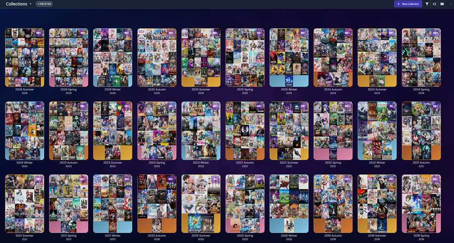
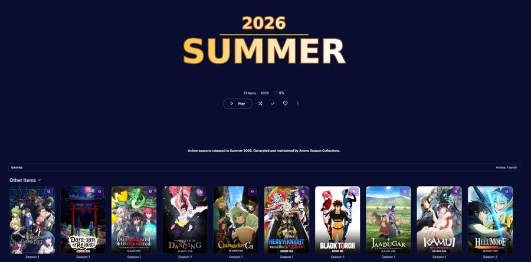
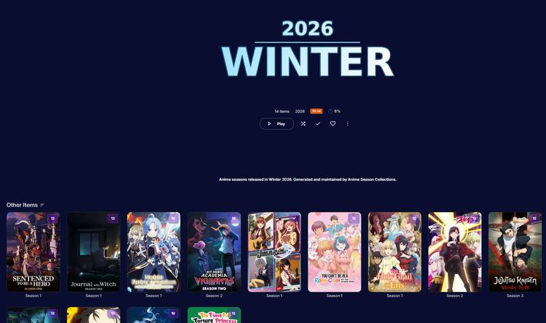

# Anime Season Collections for Jellyfin 12

This plugin was developed with assistance from ChatGPT. Maintenance is best-effort, so issue responses and fixes may sometimes be delayed.

A Jellyfin 12 / .NET 10 plugin that creates calendar-season collections from **Season items** belonging to shows whose Jellyfin **Genres** include `Anime` **or** `Animation`.

## What it does

- Scans `Series` whose `Genres` contains either `Anime` or `Animation` (case-insensitive), limited by the plugin's optional library include/exclude settings.
- Reads each regular Season; Specials/Season 0 are excluded.
- Uses the Season's own `PremiereDate`. If that is empty, the earliest dated episode is used as a fallback.
- Maps dates to:
  - December-February -> `YYYY Winter` (December is assigned to the **following year's** Winter label)
  - March-May -> `YYYY Spring`
  - June-August -> `YYYY Summer`
  - September-November -> `YYYY Autumn`
- Example: a Season dated `2025-12-20`, `2026-01-10`, or `2026-02-28` is placed into `2026 Winter`. This intentionally follows the likely **start of the anime cour** rather than where most of its episodes air.
- Creates real native Jellyfin collections containing the **Season items**, not the parent Series.
- Gives every generated collection a canonical release date at the first day of its bucket, e.g. `2026 Winter` = `2026-01-01`.
- Sets ProductionYear and a chronological ForcedSortName (`YYYY-01` through `YYYY-04`).
- Reads each generated collection's stored **BoxSet LinkedChildren** and calls Jellyfin's `ICollectionManager` only for Season IDs that are actually missing; already-added Seasons are not re-submitted on later task runs. After adding, the plugin reloads the BoxSet and verifies the actual linked membership.
- Stamps generated collections in `ProviderIds` so the plugin knows which collections it owns. It deliberately refuses to modify an unstamped user collection with the same name.
- Generates:
  - a 1500x2250 (2:3) Primary collage using all readable Primary images on the Season items;
  - a transparent 1600x600 season-coloured Logo showing the year and season name.
- Regenerates artwork only when the desired Season membership or source Season poster files change.
- Adds `Refresh Anime Season Collections` under **Dashboard -> Scheduled Tasks -> Library**.
- Default schedule: every 24 hours. Jellyfin's Scheduled Tasks UI can change or disable that schedule.
- Adds a plugin configuration page with per-library **Include** and **Exclude** controls.
  - No Include selections = all libraries are eligible.
  - One or more Include selections = only those libraries are scanned.
  - Exclude always wins and removes that library from the scan.

## Screenshots

The screenshots below show examples of collections generated by the plugin. The Jellyfin interface in these examples uses the **Glassfin CSS theme**, so the surrounding UI styling, backgrounds, spacing, and some presentation details come from Glassfin rather than from Anime Season Collections itself.

### Generated seasonal collections



The Collections view above shows multiple automatically generated seasonal collections. Each collection uses the plugin-generated 2:3 collage poster assembled from the Primary images of the Season items assigned to that release window.

### Collection details and generated logo



The `2026 Summer` example shows the generated collection logo, release year, collection metadata, and the Season items placed in that bucket.



The `2026 Winter` example shows the same generated presentation for a Winter bucket. December releases from the preceding calendar year are assigned to the following year's Winter collection, so a Season starting in December 2025 can appear in `2026 Winter`.

> **Theme note:** These screenshots use the **Glassfin CSS theme**. Glassfin is not bundled with or required by this plugin. The generated collection posters and logos are produced by Anime Season Collections; the broader Jellyfin UI appearance shown in the screenshots is provided by Glassfin.

## Important behavior

The current version is **additive**. If a Season's date is later corrected so it belongs to a different bucket, the next run adds it to the new bucket but does not automatically remove it from the old generated bucket. Automatic removal/reconciliation of outdated collection membership is not implemented in the current version.

## Install through Jellyfin's Plugin Catalog

The repository contains a Jellyfin plugin repository manifest at `manifest.json`, so the plugin can be installed and updated from Jellyfin's normal plugin page.

### Repository URL

Add this URL to Jellyfin:

```text
https://raw.githubusercontent.com/Noelzu/Jellyfin.Plugin.AnimeSeasonCollections/main/manifest.json
```

In Jellyfin:

1. Open **Dashboard -> Plugins -> Repositories**.
2. Click **+** to add a repository.
3. Use a name such as `Anime Season Collections`.
4. Paste the repository URL above.
5. Save the repository.
6. Open **Dashboard -> Plugins -> Catalog**.
7. Find **Anime Season Collections** and install it.
8. Restart Jellyfin after installation if requested.
9. Open the plugin settings page and configure library Include/Exclude rules.
10. Run **Dashboard -> Scheduled Tasks -> Library -> Refresh Anime Season Collections** once manually if you want the first collections generated immediately.

## Build locally

Requires the .NET 10 SDK.

### Windows PowerShell

```powershell
./build.ps1
```

You can also run the CMD wrapper, which keeps the window open on build failure:

```cmd
build.cmd
```

### Linux

```bash
chmod +x build.sh
./build.sh
```

The scripts publish into `dist/plugin` and create:

```text
dist/AnimeSeasonCollections_12.0.0.10.zip
```

## Manual install

Manual installation is still available if you do not want to use the Jellyfin plugin repository.

1. Stop Jellyfin.
2. Create a plugin folder, for example:
   `/config/data/plugins/AnimeSeasonCollections_12.0.0.10/`
3. Extract the contents of `dist/AnimeSeasonCollections_12.0.0.10.zip` into that folder.
4. Start Jellyfin.
5. Open the plugin settings page and choose any library Include/Exclude rules you want.
6. Run `Dashboard -> Scheduled Tasks -> Library -> Refresh Anime Season Collections` once manually.

## Compatibility

- Jellyfin Server: 12.0.x
- Target framework: `net10.0`
- Jellyfin API packages: `12.0.0`
- SkiaSharp: `3.119.4`, matching Jellyfin 12's runtime line
- Current plugin version: `12.0.0.10`

### Jellyfin 12 / SkiaSharp packaging note

The release ZIP intentionally contains only `Jellyfin.Plugin.AnimeSeasonCollections.dll` (plus optional `.pdb`/`.xml` diagnostics). Jellyfin 12 already provides SkiaSharp 3.119.4 and the Jellyfin framework assemblies.

Platform-specific files such as:

```text
runtimes/win-arm64/native/libSkiaSharp.dll
```

must **not** be placed in the plugin directory. Jellyfin can try to load such native DLLs as managed plugin assemblies and disable the entire plugin with `BadImageFormatException`.

The included build scripts and GitHub release workflow deliberately package only the plugin's own managed DLL to prevent this.

## Maintainer notes

Release publishing and manifest maintenance are documented in [RELEASING.md](RELEASING.md).
